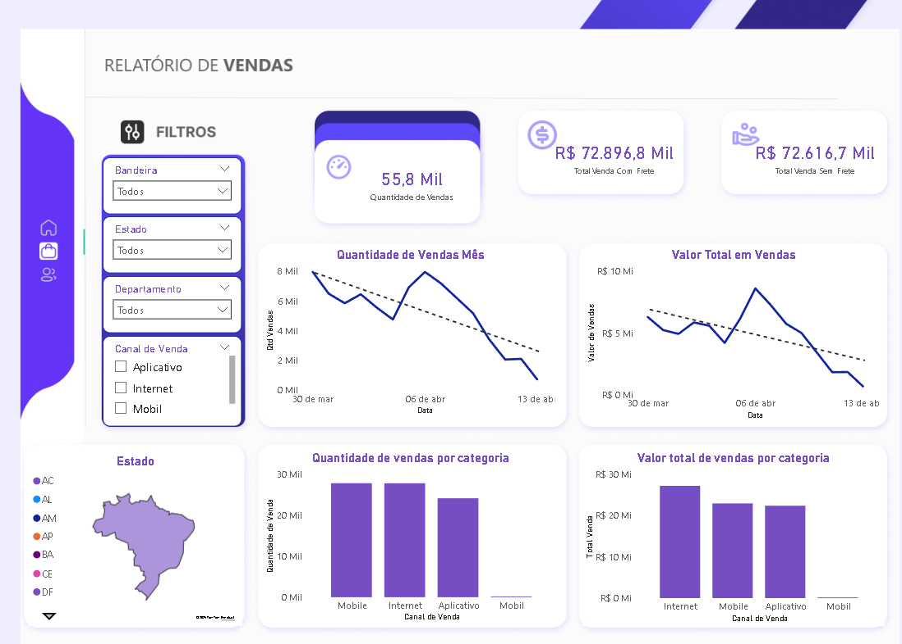
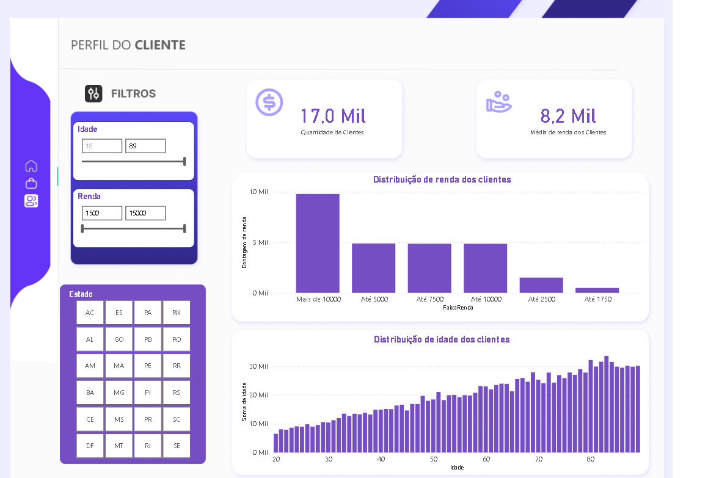

# Relatório de Vendas – Power BI

## Sobre o Projeto

No contexto empresarial, acompanhar o desempenho de vendas de forma eficiente é fundamental para identificar oportunidades, corrigir desvios e impulsionar resultados. Neste estudo de caso em Power BI, utilizei um conjunto de dados ficticios para revelar insights sobre o desempenho comercial, analisando atributos que impactam o volume de vendas, ticket médio, sazonalidade e performance por região, produto e vendedor.

Aproveitei meus conhecimentos em DAX para criar medidas personalizadas e gerar visualizações interativas e informativas. O resultado foi um dashboard, capaz de comunicar os principais insights de maneira clara para a equipe de gestão.

Este projeto proporcionou a oportunidade de praticar e demonstrar diversas habilidades no Power BI, trabalhando com dados próximos à realidade do mercado.

## Problema
Empresas frequentemente enfrentam dificuldades para acompanhar o desempenho de vendas de forma eficiente, identificar gargalos, oportunidades de crescimento e tomar decisões baseadas em dados confiáveis. A ausência de uma visão consolidada e interativa pode dificultar o planejamento estratégico e a identificação de tendências de mercado.

## Solução Proposta
O relatório de vendas em Power BI foi desenvolvido para centralizar e facilitar a análise dos dados comerciais, permitindo:
- Visualização clara e dinâmica dos principais indicadores de vendas;
- Segmentação por período, produto, região e vendedor;
- Identificação rápida de tendências, pontos fortes e áreas de melhoria;
- Tomada de decisão mais ágil e embasada.

### Habilidades Demonstradas
- Modelagem de dados
- Análise exploratória
- Criação de medidas DAX
- Design de relatórios e dashboards
- Análise de causas e tendências

Vamos explorar juntos os resultados!

## Funcionalidades
- Visão geral das vendas por período
- Análise por categoria, região e canal de vendas
- Gráficos dinâmicos e filtros interativos
- Identificação de tendências e oportunidades de crescimento

- Faixa etária dos clientes
- Contagem de clientes agrupados por Renda

## Como utilizar
1. Abra o arquivo `Relatório de Vendas.pbix` no Power BI Desktop.
2. Navegue entre as páginas do relatório para explorar diferentes análises.
3. Utilize os filtros para personalizar as visualizações conforme sua necessidade.

## Requisitos
- Power BI Desktop instalado ([Download aqui](https://powerbi.microsoft.com/pt-br/desktop/))

## Observações
- Os dados utilizados são fictícios ou anonimizados para fins de demonstração.
- Para atualizar os dados, substitua as fontes conforme necessário dentro do Power BI.

## Contato
Em caso de dúvidas ou sugestões, entre em contato.
